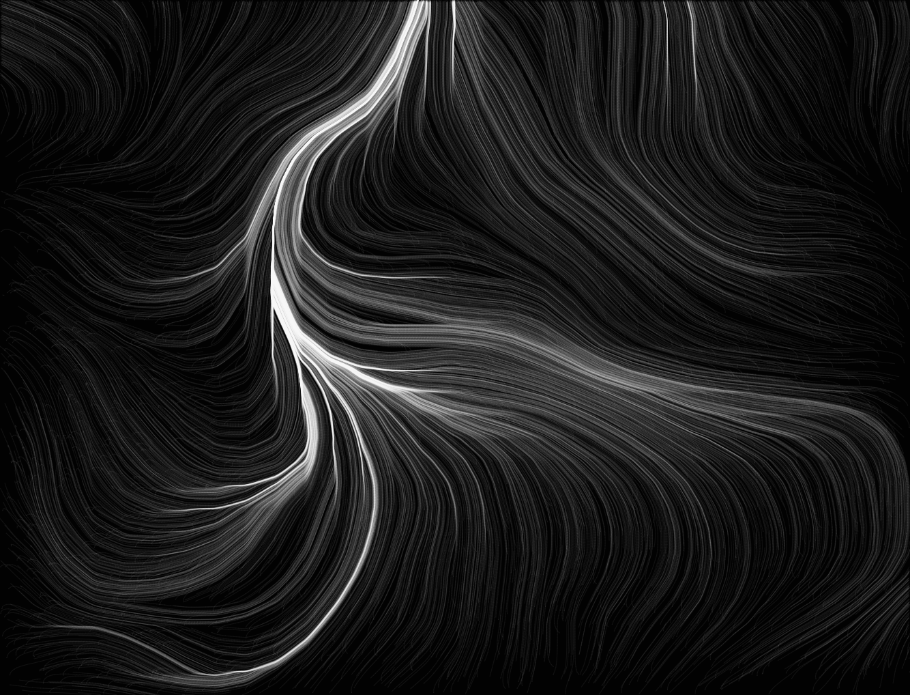
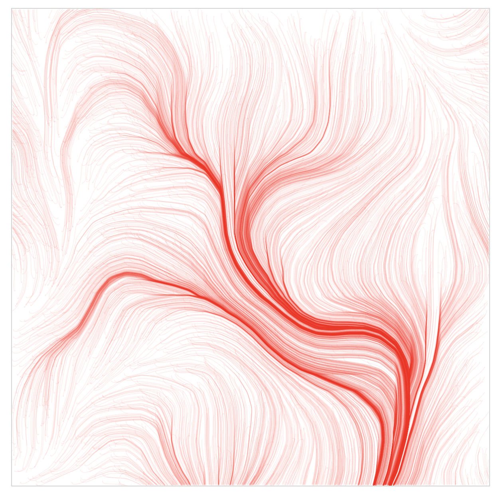

# flowFields
This project uses a particle simulation to visualize a field of directional vectors. It uses <a href = "https://en.wikipedia.org/wiki/Perlin_noise" target = "_blank">Perlin Noise</a> to construct a field of random (but related) forces in horizontal and vertical directions (that change over time). The project uses the <a href="https://p5js.org/" target="_blank">P5js</a> library, and is heavily based on this <a target = "_blank" href="https://www.youtube.com/playlist?list=PLRqwX-V7Uu6bgPNQAdxQZpJuJCjeOr7VD" >tutorial series</a> and the corresponding <a target = "_blank" href ="https://github.com/CodingTrain/website/tree/master/CodingChallenges/CC_024_PerlinNoiseFlowField/P5">code</a>.

Here are a few examples of what you can make using the tool.

